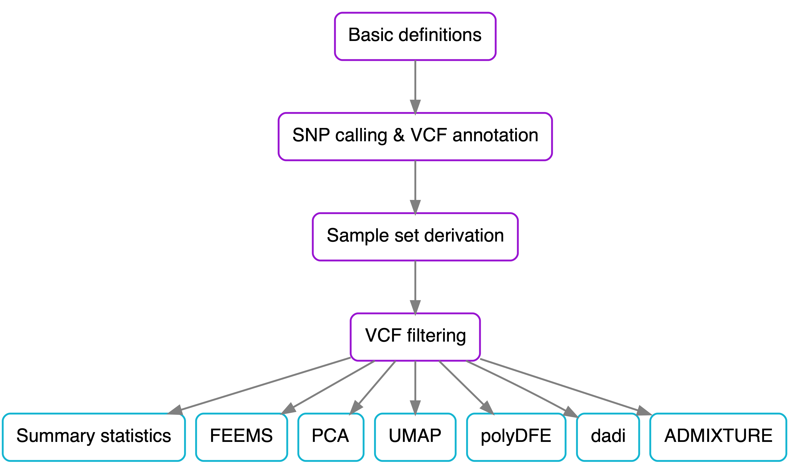
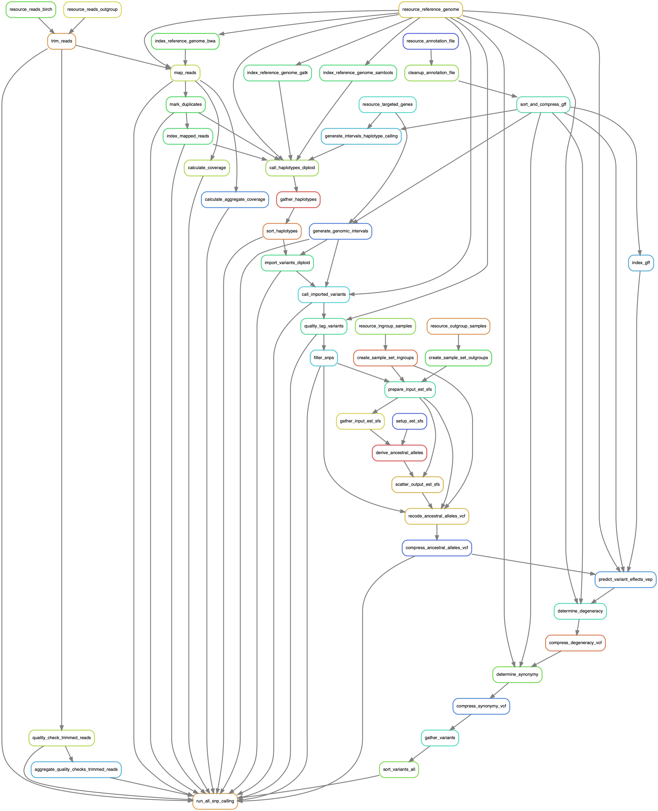
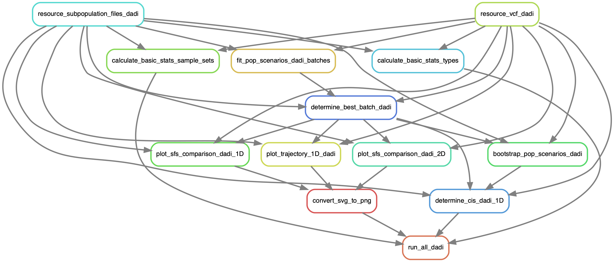
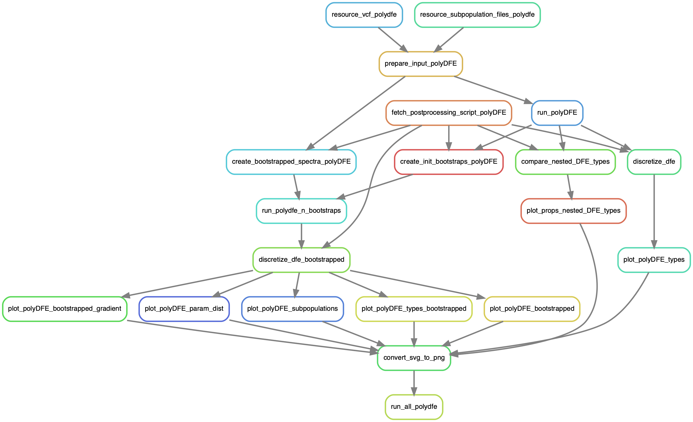
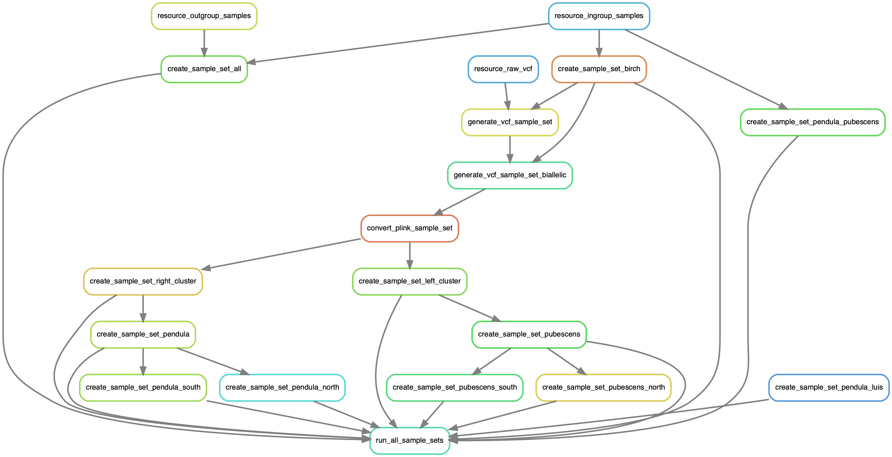
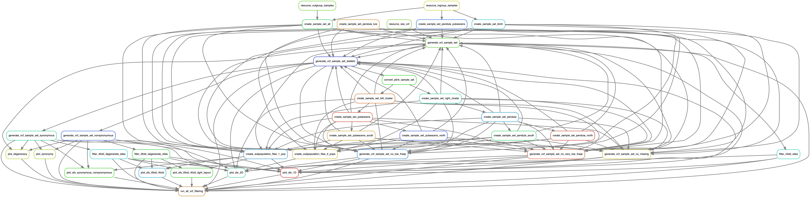
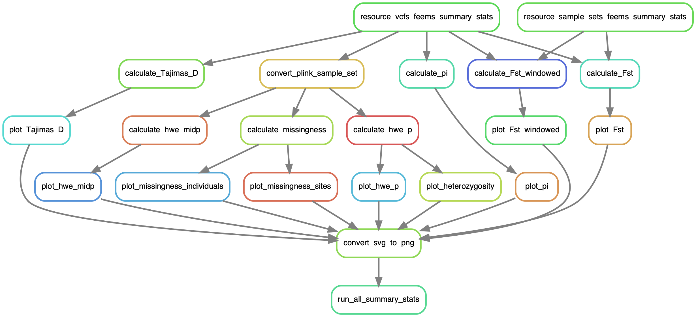

## Demography of Birch Populations across Scandinavia

Code and supplementary associated with master's thesis on the population structure, demographic history and the distribution of fitness effects of the diploid *Betula pendula* and tetraploid *B. pubescens* across Scandinavia.

- [Written report](reports/final/report.pdf)

- [Popular science summary](reports/popular_science/report.pdf)

- [Presentation](presentations/final/presentation.pdf)

## Workflows

All results are part of Snakemake pipeline, the subworkflows of which are visualised below.

### Schematic of total workflow

### SNP calling

### δaδi

### polyDFE

### Sample set derivation

### VCF filtering

### Summary statistics
